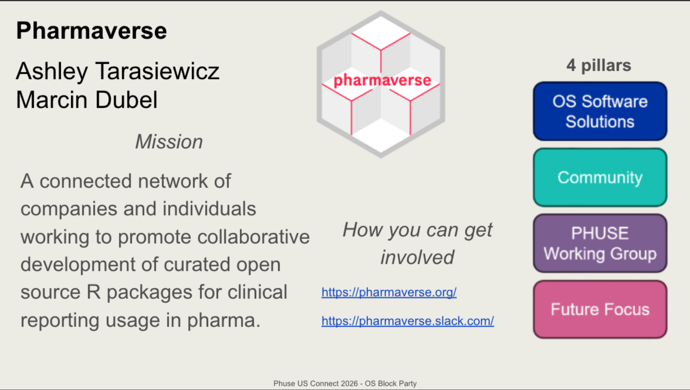
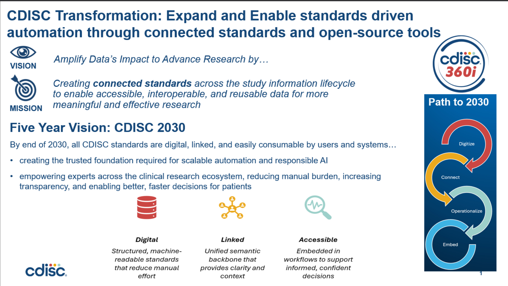
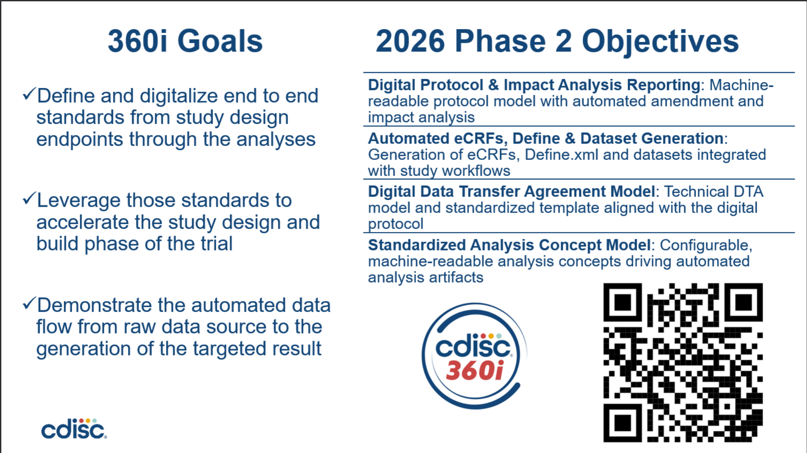

```{r setup, include=FALSE}
library(qrcode)

```

## RValidationHub

::::: {.columns}

:::: {.column width="50%"}


Doug Kelkhoff

---

<div style="text-align: center;"> _Mission_ </div>

🚀 Our mission is to leverage the open-source and collaborative nature of R while supporting its adoption within the biopharmaceutical setting.

::::

:::: {.column width="50%"}

::: {.codewindow style="font-size: 0.42em;"}

 _Current Projects_

```bash
riskmetric
val.meter
riskassessor
riskscore
```
:::

_How you can get involved_

``` {r, echo = FALSE}
generate_svg(
  qr_code("https://pharmar.org/community-meetings/"),
  size = 250,
  file = "images/qrcode.svg"
)
```


::::

:::::

## Pharmaverse




## CAMIS

::::: {.columns}

:::: {.column width="50%"}


Becca Krouse

Lyn Taylor

Christina Fillmore

---

<div style="text-align: center;"> _Mission_ </div>

<div style="font-size:30px;">
🚀 CAMIS: Comparing Analysis Method Implementations in Software. Understand and Document analysis result discrepancies across software, demonstrate the statistical methodology through examples, document in an open GitHub repository.
</div>
::::

:::: {.column width="50%"}

::: {.codewindow style="font-size: 0.42em;"}

 _Current Projects_

``` bash
- https://github.com/PSIAIMS/CAMIS/issues
  24 Open Issues / 140 Closed!
- Survival: weighted log-rank test
- Kolmogorov-Smirnov test 
- Writing content
```
:::

``` {r, echo = FALSE}
generate_svg(
  qr_code("https://psiaims.github.io/CAMIS/"),
  size = 250,
  file = "images/camis.svg"
)
```

[Get Involved - CAMIS](https://psiaims.github.io/CAMIS/)


::::

:::::

## Submissions Working Group

::::: {.columns}

:::: {.column width="45%"}


Eric Nantz

Ben Straub

---

<div style="text-align: center;"> _Mission_ </div>

<div style="font-size:30px;">
🚀 Easier R-based clinical trial regulatory submissions today by showing open examples of using current submission portals. Easier R-based clinical trial regulatory submissions tomorrow by collecting feedback and influencing future industry and agency decisions on system/process setup.

</div>

::::

:::: {.column width="55%"}

::: {.codewindow style="font-size: 0.36em;"}

 _Current Projects_

``` bash
- Pilot 4 – Using webassembly and containers for submission
  packages to FDA is finishing up. Report coming soon
- Pilot 5 – Using datasetjson instead of xpts for
  submission packages to FDA is under review by FDA.
- Pilot 6 – Expansion of dataset and TLF programming for
  future submissions – in progress
- Pilot 7 – Creating new simulated datasets for future
  submissions and benchmarking – in progress
```
:::

``` {r, echo = FALSE}
generate_svg(
  qr_code("https://rconsortium.github.io/submissions-wg/join.html/"),
  size = 250,
  file = "images/swg.svg"
)
```

[How to Join – R Submissions](https://rconsortium.github.io/submissions-wg/join.html/)


::::

:::::

## CDISC



## CDISC Goals



## RConsortium


::::: {.columns}

:::: {.column width="45%"}


Benjamin Arancibia

---

<div style="text-align: center;"> _Mission_ </div>

<div style="font-size:30px;">
🚀 The central mission of the R Consortium is to work with and provide support to the R Foundation and to the key organizations developing, maintaining, distributing and using R software through the identification, development and implementation of infrastructure projects.

</div>

::::

:::: {.column width="55%"}

::: {.codewindow style="font-size: 0.36em;"}

 _Current Projects_

``` bash
- Submissions Working Group
- R Tables for Regulatory Submission (RTRS)
- RValidationHub
- Many Others!
```
:::

_How you can get involved_

``` {r, echo = FALSE}
generate_svg(
  qr_code("https://r-consortium.org/"),
  size = 250,
  file = "images/rconsort.svg"
)
```

[R Consortium](https://r-consortium.org/)


::::

:::::

## DVOST


::::: {.columns}

:::: {.column width="45%"}

Mike Stackhouse

Hanming Tu

Nick Masel

---

<div style="text-align: center;"> _Mission_ </div>

<div style="font-size:25px;">
🚀 Data Visualisation and Open Source Technology aims to support, address, and answer pertinent questions around Data Visualisation and Open Source Technology. The combination of these two subjects is natural in today’s environment given the powerful Data Visualisation tools within the Open Source languages available today.

</div>

::::

:::: {.column width="55%"}

::: {.codewindow style="font-size: 0.36em;"}

 _Current Projects_

``` bash
- PharmaForest: A Collaborative Repository of SAS Packages for Pharmaceutical Industry
- Comparing Analysis Method Implementations in Software (CAMIS)
- Clinical Visual Analytics for Review and Submission (CVARS)
- and many others!
```
:::

``` {r, echo = FALSE}
generate_svg(
  qr_code("https://advance.hub.phuse.global/wiki/spaces/WEL/pages/26804419/Data+Visualisation+Open+Source+Technology/"),
  size = 250,
  file = "images/dvost.svg"
)
```

[How to Join - DVOST](https://advance.hub.phuse.global/wiki/spaces/WEL/pages/26804419/Data+Visualisation+Open+Source+Technology/)


::::

:::::

## r/pharma


::::: {.columns}

:::: {.column width="45%"}


Phil Bowsher

---

<div style="text-align: center;"> _Mission_ </div>

<div style="font-size:30px;">
🚀 R/Pharma is a scientifically & industry oriented, collegial online conference focused on the use of R in the development of pharmaceuticals, with breakout in-person and APAC satellite events.

</div>

::::

:::: {.column width="55%"}

::: {.codewindow style="font-size: 0.36em;"}

 _Current Projects_

``` bash
- R/Pharma Virtual 2026: October 20-21
```
:::

_How you can get involved_

``` {r, echo = FALSE}
generate_svg(
  qr_code("https://rinpharma.com//"),
  size = 250,
  file = "images/rpharma.svg"
)
```

[R/Pharma](https://rinpharma.com//)


::::

:::::

## Mixer

<div style="text-align: center;">  </div>
